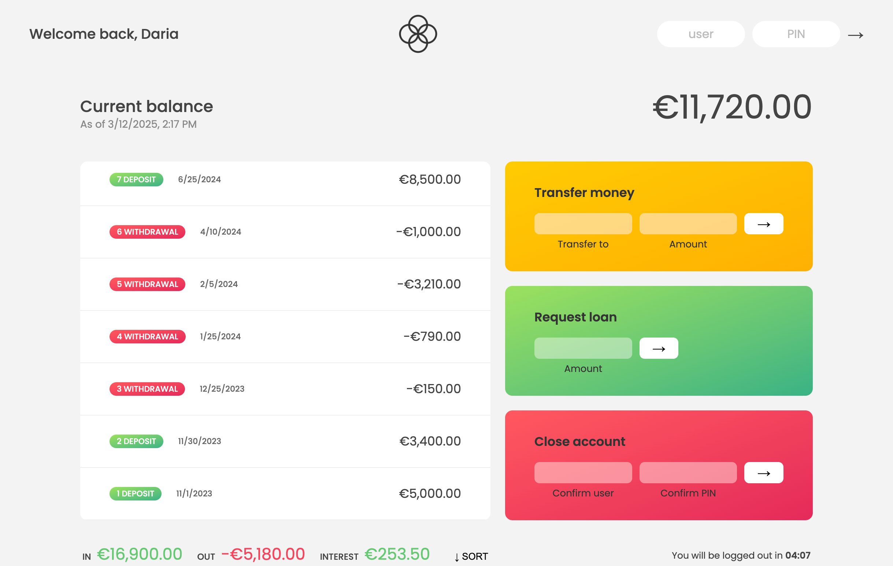

# Bankist App Documentation

## Overview

The Bankist App is a JavaScript application that allows users to log in, view their transactions, transfer money, request loans, and close their accounts. The app features formatted currency and date displays, along with an automatic logout timer for security.

## Live-Demo

[VISIT WEBPAGE](https://bankist-app-daria-aleshina.netlify.app/)

Use these user login credentials:

- user: **js** | PIN: **1111**
- user: **da** | PIN: **2222**

⚠️ Mobile Responsiveness: This project is best viewed on desktop. Mobile support is in progress!

## Features

- **User Authentication**: Users log in using their username and PIN.
- **Transaction Display**: Lists deposits and withdrawals with formatted dates.
- **Balance Calculation**: Updates and displays the current balance dynamically.
- **Money Transfer**: Allows users to transfer money to other accounts.
- **Loan Request**: Users can request loans based on eligibility criteria.
- **Account Closure**: Users can close their accounts after authentication.
- **Sorting**: Transactions can be sorted by amount.
- **Logout Timer**: Automatic logout after inactivity.

## Acknowledgments

This project is inspired by **Jonas Schmedtmann's JavaScript course on Udemy**. HTML / CSS provided by the course.
